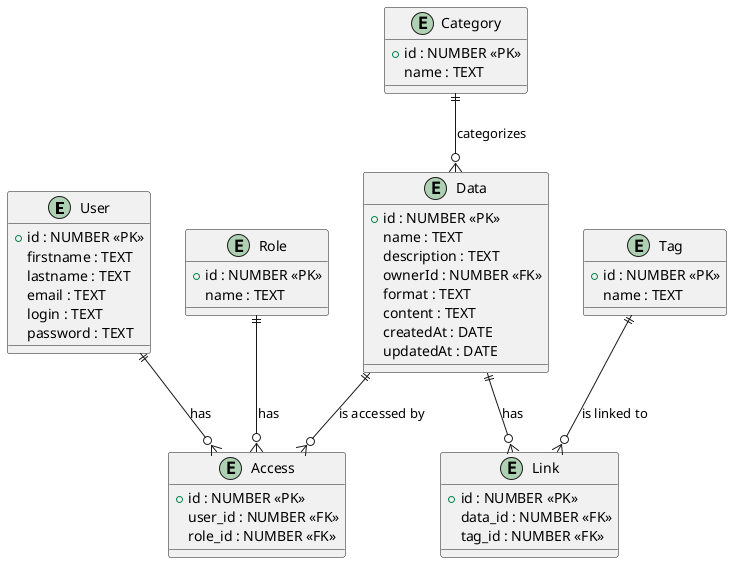

# Проєктування бази даних

## Короткий зміст:
- [модель бізнес-об'єктів](#BusinessObjectsModel)
- [ER-модель](#ERModel)
- [реляційна схема](#RelationalSchema)

## ER-модель
**ER-модель** - це модель даних, яка дозволяє описувати концептуальні схеми за допомогою узагальнених конструкцій блоків. ER-модель — це метамодель даних, тобто засіб опису моделей даних. Існує ряд моделей для представлення знань, але одним з найзручніших інструментів уніфікованого представлення даних, незалежного від програмного забезпечення, що його реалізує, є модель «сутність-зв'язок». Важливим є той факт, що з моделі «сутність-зв'язок» можуть бути породжені всі існуючі моделі даних (ієрархічна, мережева, реляційна, об'єктна), тому вона є найзагальнішою.

