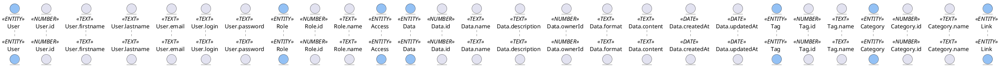

# Проєктування бази даних

```plantuml
@startuml

entity User <<ENTITY>> #93C1F5
entity User.id <<NUMBER>> 
entity User.firstname <<TEXT>> 
entity User.lastname <<TEXT>> 
entity User.email <<TEXT>> 
entity User.login <<TEXT>> 
entity User.password <<TEXT>> 

entity Role <<ENTITY>> #93C1F5
entity Role.id <<NUMBER>> 
entity Role.name <<TEXT>> 

entity Access <<ENTITY>> #93C1F5

entity Data <<ENTITY>> #93C1F5
entity Data.id <<NUMBER>> 
entity Data.name <<TEXT>>
entity Data.description <<TEXT>>
entity Data.ownerId <<NUMBER>> 
entity Data.format <<TEXT>> 
entity Data.content <<TEXT>> 
entity Data.createdAt <<DATE>> 
entity Data.updatedAt <<DATE>> 

entity Tag <<ENTITY>> #93C1F5
entity Tag.id <<NUMBER>> 
entity Tag.name <<TEXT>> 

entity Category <<ENTITY>> #93C1F5
entity Category.id <<NUMBER>> 
entity Category.name <<TEXT>> 

entity Link <<ENTITY>> #93C1F5

@enduml
```

